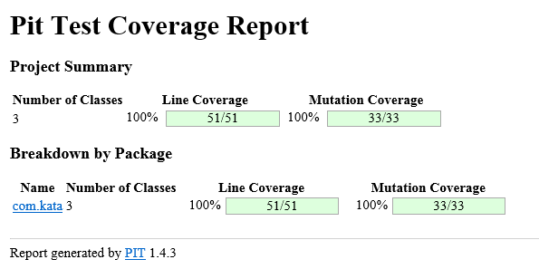

# Bowling
Project to calculate score for Bowling game which consist of 10 turns of bowling where each turn is known as frame which itselfs consist of 2 rolls.
for each roll, bowl would be rolled to knock down 10 pins and score would be calculated based on the outcome of number of pins kocked down.


More info on the rules at: [How to Score for Bowling](www.topendsports.com/sport/tenpin/scoring.htm)


# Purpose
This is an Practice program to showcase Test Driven Development


# Functional Case:

````
-Calculate score of one frame, when both rolls miss to knock down any pin
-Calculate score of one frame, when few pins are knocked down in both rolls
-Calculate frame score when All pins are knocked down in one frame and some pins are knocked next roll(Spare)
-Calculate frame score when All pins are knocked down in First roll and some pins are knocked next Frame(Strike)
-Calculate game score for one frame when zero pins are knocked down in both rolls
-Calculate game score having two frames where first frame is spare and in second frame few pins are knocked down
-Calculate game score having two frames where first frame is strike and in second frame few pins are knocked down
-Calculate game score for ten frames which does not include any strike or spare
-Calculate game score for ten frames which include  strike and spare as well
-Calculate game score for ten frames which include spare on tenth frame
-Calculate game score for ten frames which include strike on tenth frame

````

# Prerequisite:

````
Jdk 1.7 or above
IDE (Eclipse or Intellij)
Maven 3.0
````

# How to run this App

Follow below instructions to run this app
````
-git clone https://github.com/dishantj4/Bowling.git
-Go to src/test/java/com/kata/BowlingTest.java and run the Junit Test case or run below maven command.

$ mvn clean test

````

# Code Coverage and Mutation Test

View Code Coverage Report at ‘target/site/jacoco/index.html’

Below is the Mutation Test Report




